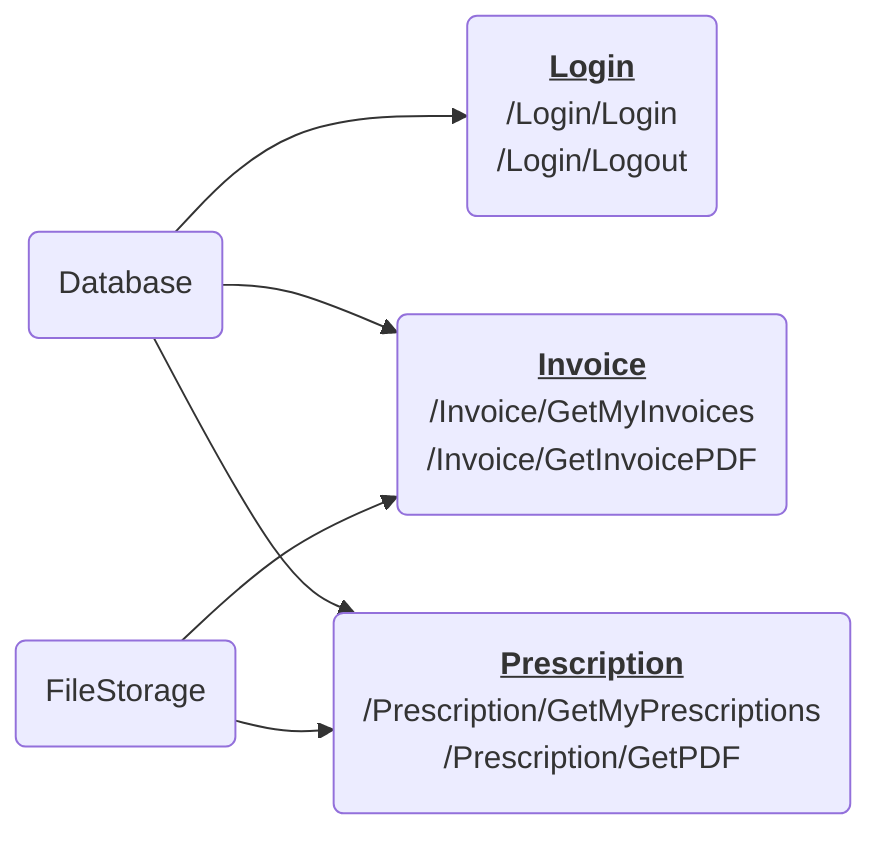
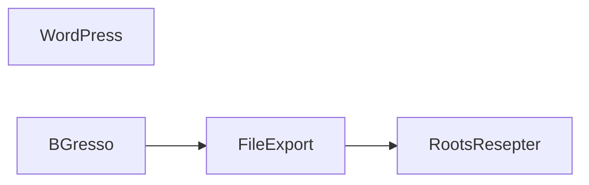

# Roots Apotek - Microservice for Resepter

## Hendelse
Roots Apotek fikk melding om at resepter fra dem var på avveie. Kilden var en av deres microservices for nedlasting av PDFer for respet og faktura. De fant ut at URLen `/Prescription/GetPdf` var mulig for innloggede brukere å laste ned andres resepter. 

Årsaken ble identifisert til controlleren `PrescriptionController.cs`, og hullet er tettet. 

Etter en sikkerhetsgjennomgang er det avdekket at loggene på ryddes opp i. 
Fødselsnummer havner loggene selv om det andre IDer kunne vært benyttet. 
I tillegg mangler det logging av forsøk på nedlastinger som feiler.

Dette er dere i Sopra Steria hyret inn for å løse.

## Arkitektur
Roots Apoteks mikroservice for resepter består av 3 *controllere* (Login, Prescriptions og Invoice) som tilbyr URLer, og 2 *servicer* som snakker med backend.

Dataflyt er som følger:

# Systemskisse

