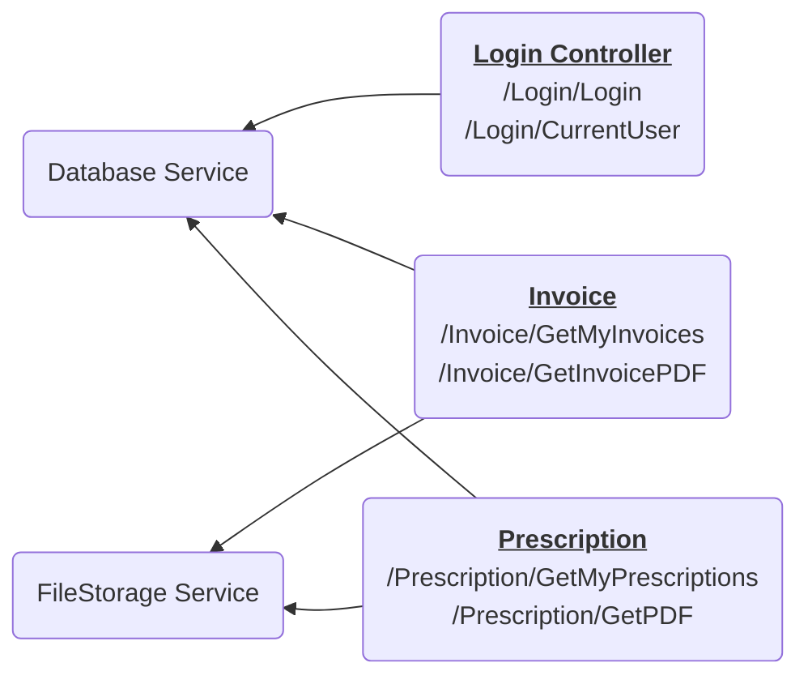

# Roots Apotek - eResept

Velkommen til dag to av kurset. I dag tar dere rollen som utviklere! Først, la oss gå gjennom hva som har skjedd.

Roots Apotek fikk en melding om at kundenes resepter var på avveie. Kilden var en av microservicene, eResept, for nedlasting av PDFer for resepter og faktura. De fant ut at det var mulig å for innloggede brukere å laste ned andres resepter gjennom URLen `/Prescription/GetPdf`. 
Sårbarheten lå i funksjonen `GetPdf()` i controlleren [`PrescriptionController.cs`](RootsPrescription/Controllers/PrescriptionController.cs). Hullet er nå tettet og dere kan anta at funksjonen er sikker.

Etter sikkerhetsgjennomgangen er det avdekket at loggene må ryddes opp i. Dette er dere i Sopra Steria hyret inn for å løse. Begynn på [oppgaven om trusselmodellering](Oppgaver/0_trusselmodellering.md).

> Vi anbefaler at en i gruppa setter maskinen sin på storskjerm gjennom alle 
> oppgavene slik at vi jobber sammen som et team.
>
> Alle oppgavene er lagt opp slik at man kun trenger nettleseren for å løse dem.
> Vanligvis vil utviklere bruke en teksteditor som Visual Studio Code eller
> IntelliJ, men det trenger dere ikke i dag.
>
> Oppgavetekstene skal være klar nok til å ikke trenge utviklererfaring. Noter
> at det er vanlig å synes det er litt forvirrende og det er helt OK å trenge
> hjelp. Spør oss om dere lurer på noe!

## Arkitektur
Roots Apoteks har eksportert en mappe med PDFer (resepter og faktura) fra det gamle fagsystemet sitt slik kunden kan få tilgang til sine dokumenter. PDFene ligger lagert i en beskyttet mappe som kun en systembrukeren har tilgang til. 

De har laget en mikroservice, *eResept*, som tilbyr resepter og fakturakopi til kundene på internett.

Microservicen for resepter består av 3 *controllere* (Login, Prescriptions og Invoice) som tilbyr URLer, og 2 *servicer* (FileStorage og Database).

# Ordbok
På samme måte når slakteren setter ulike navn på de ulike delene av grisen når den slaktes, setter programmerer ulike navne på de ulike delene inne i et system.

Her er en liten kort forklaring på noen av dem slik de er brukt hos Roots Apotek
- *Endepunkt* - Et fancy ord for URL (men vanligvis for URLer der det skjer noe på serveren når noen besøker URLen)
- *API* - En samling URLer (*endepunkter*) som er strukturert slik at maskiner lettere kan snakke sammen. (*Application programming interface* eller *grensesnitt*)
- *Controller* - En del av systemet som har regler om hvordan ting skal utføres. *Endepunkter* samles gjerne i en eller flere *controllere*
- *Service* - I *denne* sammenhengen er *service* den delen av systemet som "leverer tjenester" til *controllerne*. F.eks. henter og skriver data fra databasen, henter filer fra mapper, e.l.
- *Microservice* - Har ingenting med *service* som i punktet over å gjøre. Nå zoomer vi ut noen hakk, og ser alle IT-tjenestene til hele Roots Apotek. De kunne ha samlet alle disse en én stor maskin, eller de kan dele tjeneste opp i mindre maskiner som snakker sammen. Disse småmaskinene kalles *micro*-servicer.
