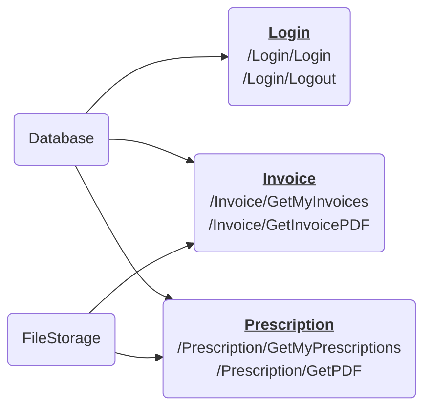
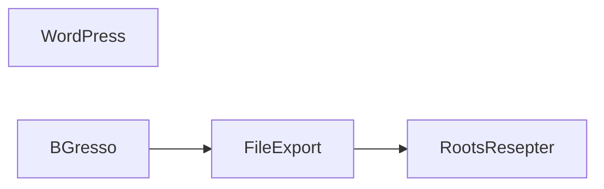

# Roots Apotek - Microservice for resepter

## URL
Hver gruppe har sin egen applikasjon med egen URL. Under er URLen til applikasjonen deres, husk å bytte med deres gruppenummer. 

**https://csa-gr[gruppenummer]-app.scm.azurewebsites.net/**

> Når vi snakker om en URL og en tekst som inneholder en slash (/), mener vi URLen deres med denne teksten bak. F.eks. `/Prescription/GetPdf` blir til "https://csa-gr[gruppenummer]-app.scm.azurewebsites.net/Prescription/GetPdf".

## Introduksjon
Velkommen til dag to av kurset. I dag tar dere rollen som utviklere! 
Applikasjonen dere ble presentert for på dag 1 skal vi nå utvikle videre på.

Først, la oss gå gjennom hva som har skjedd.
Roots Apotek fikk en melding om at deres resepter var på avveie. Kilden var en av microservicene for nedlasting av PDFer for resept og faktura. De fant ut at det var mulig å for innloggede brukere å laste ned andres resepter gjennom URLen `/Prescription/GetPdf`. 

Årsaken til sårbarheten ble identifisert. Sårbarheten lå på i funksjonen [GetPdf](RootsPrescription/Controllers/PrescriptionController.cs#L51-L85) i controlleren `PrescriptionController.cs`. Hullet er nå tettet og dere kan anta at funksjonen er sikker.

Etter en sikkerhetsgjennomgang er det avdekket at loggene må ryddes opp i. Dette er dere i Sopra Steria hyret inn for å løse.

Dere kan begynne på [oppgaven om trusselmodellering](Oppgaver/1_trusselmodellering.md).  

> Alle oppgavene er lagt opp slik at man kun trenger nettleseren for å løse dem.
> Vanligvis vil utviklere bruke en teksteditor som Visual Studio Code eller
> IntelliJ, men det trenger dere ikke i dag.
>
> Oppgavetekstene skal være klar nok til å ikke trenge utviklererfaring. Noter
> at det er vanlig å synes det er litt forvirrende og det er helt OK å trenge
> hjelp. Spør oss om dere lurer på noe!

## Arkitektur
Roots Apoteks mikroservice for resepter består av 3 *controllere* (Login, Prescriptions og Invoice) som tilbyr URLer, og 2 *servicer* som snakker med backend.

Dataflyt er som følger:

# Systemskisse

