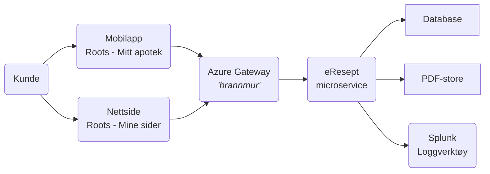
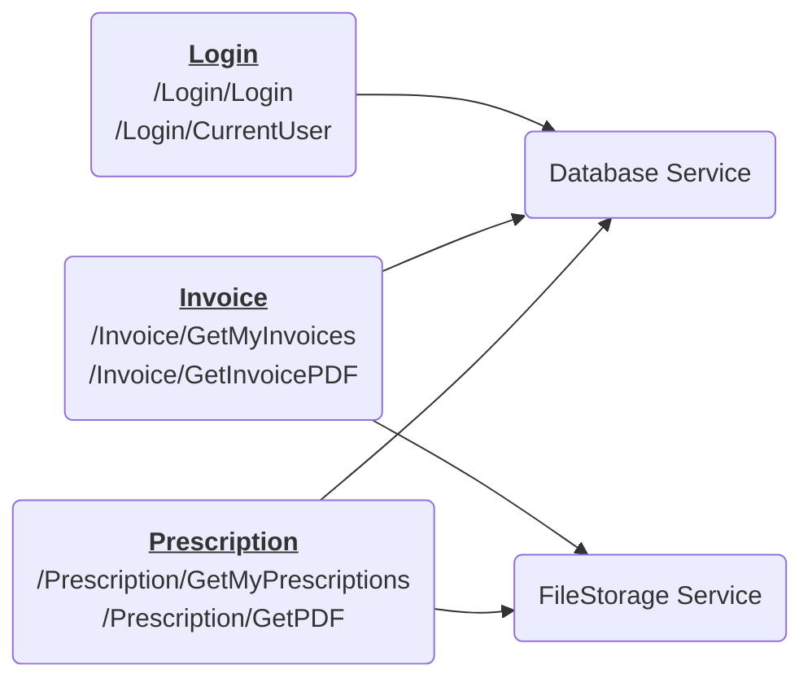

# Roots Apotek - eResept

Velkommen til dag to av kurset. I dag tar dere rollen som utviklere! Først, la oss gå gjennom hva som har skjedd.

Apoteket har både personlige nettsider og en mobilapp. Disse snakker med en *microtjeneste* ved navn *eResept* som tilbyr et *API* som nettsidene og mobilappen benytter. eResept krever pålogging før den gir ut informasjon og PDFer til sluttkundene.

En av Roots Apotek sine kunder meldte ifra at de klarte å hente ut andre kunder sine resepter. Roots Apotek stengte ned tjenesten, fikk tettet hullet, og meldte ifra til Datatilsynet om avviket.

eResept ligger bak en webapplikasjon-brannmur (*Azure Gateway*), og den sender alle sine logger til et verktøy som heter *Splunk*.

Pilene peker i retningen for *hvem som initerer kommunikasjonen*. Ikke hvilken vei data flyter.
 

# Praktisk tilnærming til oppgaven
Noen grupper sitter i fysiske grupperom, mens andre er i virtuelle teams-rom. 

> Vi anbefaler at dere velger en leder (en *"IT-sjef"* i Roots Apotek), og en hovedansvarlig for programmeringen (*"security champion"*). 
>
> * Den som er *security champion* deler sin skjerm på storskjerm eller i Teams, og må være litt *lærer* slik at alle henger med på det som gjøres.
>
> * *IT-sjefen* har et ansvar for at ingen faller ut. Dvs, fordele oppgaver der det er mulig, f.eks. bidra med å lete etter feil, finne informasjon i Splunk, eller fokusere på å lære noe. 

Alle oppgavene er lagt opp slik at man kun trenger nettleseren for å løse dem. Vanligvis vil utviklere bruke en teksteditor som Visual Studio Code eller IntelliJ, men det trenger dere ikke i dag.

> Oppgavetekstene skal være klar nok til å ikke trenge utviklererfaring.
> Det er vanlig å synes det er litt forvirrende i starten, og det er helt 
> OK å trenge hjelp. Spør oss om dere lurer på noe!

## Sikkerhetsbrist
Både nettsidene og mobilappen var ok. Her var det ikke mulig å hente andres resepter. 

Det viste seg at microservicene eResept hadde en feil, slik at det var mulig for innloggede brukere å laste ned andres resepter gjennom URLen `/Prescription/GetPdf`. 
Sårbarheten lå altså i funksjonen `GetPdf()` i controlleren [`PrescriptionController.cs`](RootsPrescription/Controllers/PrescriptionController.cs). Hullet er nå tettet og dere kan anta at denne funksjonen er sikker.

Etter en sikkerhetsgjennomgang ble det avdekket at loggene må ryddes opp i. Dere i Sopra Steria er hyret inn som sikkerhetseksperter for å løse dette, samt melde ifra om dere finner andre sårbarheter i koden. Begynn med å få oversikt med [oppgaven om trusselmodellering](Oppgaver/0_trusselmodellering.md).

## Arkitektur
Roots Apoteks har eksportert en mappe med PDFer (resepter og faktura) fra det gamle fagsystemet sitt slik kunden kan få tilgang til sine dokumenter. PDFene ligger lagert i en beskyttet mappe som kun en systembrukeren har tilgang til. 

De har laget en mikroservice, *eResept*, som tilbyr resepter og fakturakopi til kundene på internett.

Microservicen for resepter består av 3 *controllere* (Login, Prescriptions og Invoice) som tilbyr URLer, og 2 *servicer* (FileStorage og Database).

# Ordbok
På samme måte når slakteren setter ulike navn på de ulike delene av grisen når den slaktes, setter programmerer ulike navn på de ulike delene inne i et system.

Her er en liten kort forklaring på noen av dem slik de er brukt hos Roots Apotek
- *Endepunkt* - Et fancy ord for URL (men vanligvis for URLer der det skjer noe på serveren når noen besøker URLen)
- *API* - En samling URLer (*endepunkter*) som er strukturert slik at maskiner lettere kan snakke sammen. (*Application programming interface* eller *grensesnitt*)
- *Controller* - En del av systemet som har regler om hvordan ting skal utføres. *Endepunkter* samles gjerne i en eller flere *controllere*
- *Service* - I *denne* sammenhengen er *service* den delen av systemet som "leverer tjenester" til *controllerne*. F.eks. henter og skriver data fra databasen, henter filer fra mapper, e.l.
- *Microservice* - Har ingenting med *service* som i punktet over å gjøre. Nå zoomer vi ut noen hakk, og ser alle IT-tjenestene til hele Roots Apotek. De kunne ha samlet alle disse en én stor maskin, eller de kan dele tjeneste opp i mindre maskiner som snakker sammen. Disse småmaskinene kalles *micro*-servicer.
